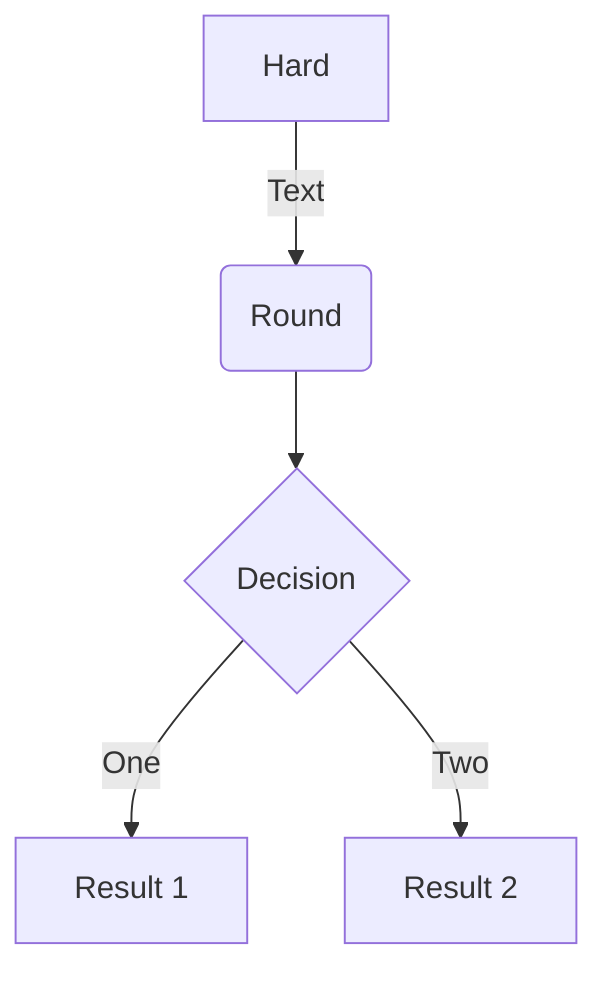

```python exec
import numpy as np
import matplotlib.pyplot as plt

keys = range(1, 20)
values = np.random.random(len(keys)) * 10

def median(vals):
    sorted_vals = sorted(vals)
    if len(sorted_vals) % 2 == 0:
        return (sorted_vals[len(sorted_vals)//2] + sorted_vals[len(sorted_vals)//2 - 1])/2
    else:
        return sorted_vals[len(sorted_vals)//2]
```

# This is a markdown title

This is a paragraph.....
This is a second paragraph.

```python exec
some_var = 23
```

```python exec
value = -1/16
print(frac(value))
```

$$2.3 * 10 = py`print(some_var)`$$

```python exec
table(header=keys, rows=[values, values])
```

```python exec
table(header=keys, rows=[values, values], corner="j")
```

```python exec
table(header=keys, left_header=["day 1", "day 2"], rows=[values, values], corner="j \\ i")
1/0
```

```python exec
table(left_header=["day 1", "day 2"], rows=[values, values])
```

```python exec
table(left_header=keys, cols=[values])
```

```python exec
def a():
    return 1

def b():
    return a() + 1

pprint(b())
```


This is a paragraph.
This is a paragraph.

**Average**:
```python exec
pprint(sum(values)/len(values))
```

**Median**:
```python exec
pprint(median(values))
```

$\frac{1}{2}$

$$
x = \sqrt{\frac{1}{y - x^2 + 3}}
$$

```python exec
# plot values as bar graph
fig, ax = plt.subplots()
fig.set_figwidth(10)
fig.set_figheight(4)
ax.set_ylabel("Values")
ax.set_xticks(keys)
ax.plot(keys, values, '--o')
img_plot(fig)
```

Chartjs:

```python exec
values2 = np.random.random(len(keys)) * 10
values3 = np.random.random(len(keys)) * 10
values4 = np.random.random(len(keys)) * 10
values5 = np.random.random(len(keys)) * 10

chart = Chartjs(keys)
chart.plot(values)
chart.plot(values2, "Dataset 2")
chart.plot(values3, "Dataset 3", "line")
chart.show()
```

Another

```python exec
graph = Graph(xrange=[-10,10], yrange=[-2,2])
graph.fig.set_figwidth(10)
graph.fig.set_figheight(7)
graph.plot_between(lambda x: np.sin(x), lambda x: np.cos(x))
graph.show()
```



This is a paragraph with code within py`print("hi")` it
